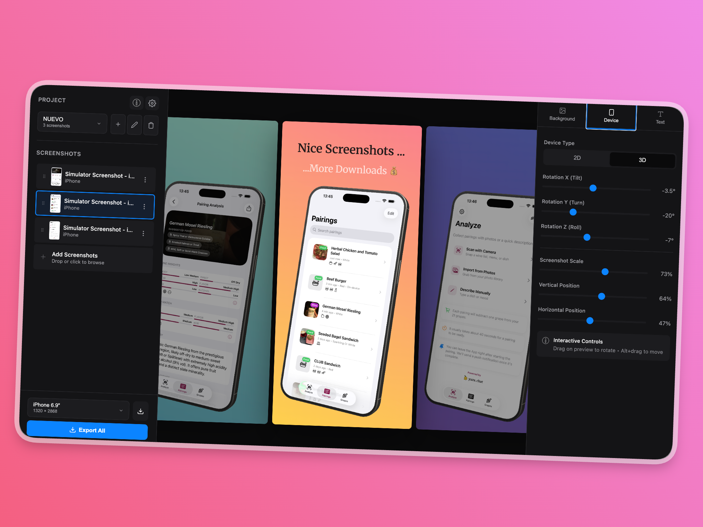

# Showglass

**Showglass** is a free, open-source **App Store screenshot studio**—beautiful marketing frames with customizable backgrounds, text overlays, 3D device mockups, and AI-assisted translations. Everything runs in your **browser**; nothing to install.

> **Repository:** [`github.com/huzairulshazmey/showglass`](https://github.com/huzairulshazmey/showglass) — update the username in URLs if your GitHub account differs.

## Features

### Output & export
- **Multiple output sizes**: iPhone 6.9", 6.7", 6.5", 5.5" and iPad 12.9", 11" (App Store–friendly), plus custom sizes
- **Batch export**: All screenshots as one ZIP
- **Per-screenshot settings**: Background, device, and text per slide

### Backgrounds
- **Gradients**: Multi-stop, draggable stops, angle control, presets
- **Solid colors**
- **Images**: Upload with blur, overlay, and fit
- **Noise overlay**

### Device mockups
- **2D mode**: Position, scale, rotate, corner radius
- **3D mode**: Interactive iPhone 15 Pro Max–style mockup (drag to rotate)
- **Position presets**: Centered, bleed, tilt, perspective, and more
- **Shadows & borders**

### Text overlays
- **Headline & subheadline** with toggles
- **1500+ Google Fonts** with search
- **Styling**: weight, italic, underline, strikethrough
- **Placement**: top / center / bottom with offset
- **Line height** for multi-line copy

### Languages & AI
- **Multiple languages** and flag switcher
- **AI translation** via Claude, OpenAI, or Google (API keys stored locally in the browser)
- **Per-screenshot** language variants
- **Localized screenshots** from filenames; smart duplicate handling on upload
- **Export** current language or all languages in separate folders

### Projects & UI
- **Multiple projects** with rename/delete
- **Auto-save** to browser storage (IndexedDB)
- **Dark / light / auto** theme
- **Side carousel**, drag-and-drop order, collapsible panels, tab memory

## Getting started

Open the app in your browser:

**[huzairulshazmey.github.io/showglass](https://huzairulshazmey.github.io/showglass/)**

## Data & privacy

Showglass **does not send your projects to any server or database**. There is **no cloud storage** and **no Showglass backend** holding your files—everything stays **in your browser, on your device**:

| Storage | What it holds |
|--------|----------------|
| **IndexedDB** | Projects, screenshots, and most editing data (auto-save). |
| **localStorage** | Theme, sidebar tab, AI provider choice, model picks, and API keys. |

Clearing site data, private browsing limits, or using another browser means that local copy of your work is gone unless you **export** what you need. AI features only contact **your chosen provider** (e.g. OpenAI, Anthropic, Google) from the browser—not a Showglass database.

## Usage (quick)

1. Upload screenshots (drag-drop or browse).
2. Pick output size in the sidebar.
3. Set background (gradient, solid, or image).
4. Position the shot (2D or 3D).
5. Add headline / subheadline.
6. Export one file or **Export all** as ZIP.

## AI translation

1. Open **Settings** (gear).
2. Choose provider: **Anthropic**, **OpenAI**, or **Google**.
3. Paste your API key and pick a model; **Save Settings**.
4. Add languages, then use the translate / AI flows in the UI.

Keys are only stored in **your browser** and sent to the provider you chose.

## Tech stack

- Vanilla JavaScript, HTML5 Canvas, Three.js, CSS  
- IndexedDB persistence, JSZip, Google Fonts API  

## License

MIT — see [LICENSE](LICENSE).
